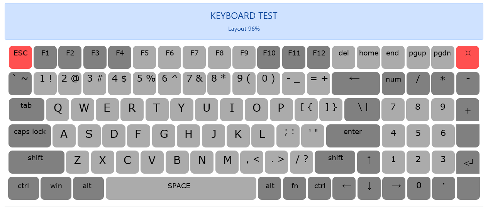

# Keyboard Test

Keyboard test ini dibuat menggunakan javascript _window.addEventListener("keydown")_ dan _window.addEventListener("keyup")_.   
Bootstrap digunakan untuk mempermudah pembuatan layout keyboard.   
Layout keyboard mengadopsi keyboard keychron K4 V2 seperti yang saya gunakan.

___   
Preview:   

Demo:
[https://anshori.github.io/keyboard-test/](https://anshori.github.io/keyboard-test/)

Tombol yang tidak bekerja: **fn** & **lampu**

___   
> unsorry@2021